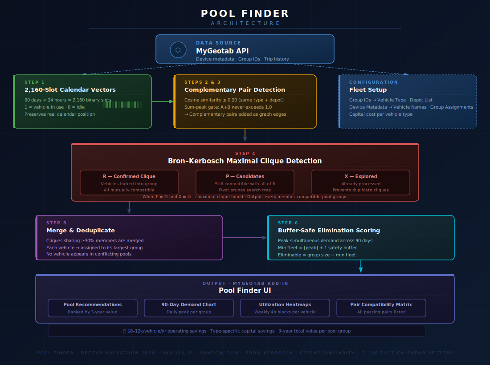

# 🚗 Pool Finder
**A fleet vehicle pool optimizer built for the Geotab Hackathon**

> *Analyzes 90 days of hourly utilization to find vehicles that are never needed on the road at the same time — and tells you exactly how many you can safely eliminate.*

---

## 🎥 Demo Video
*[Youtube Link](https://youtu.be/dhjaQ14ta_4)*

---

## Architecture


---

## Why I Built This

I work at Xcel Energy, one of the largest utility fleets in the country at over 8,000 mixed vehicles. At Geotab Connect this year, I kept hearing the same frustration from fleet managers across utilities, municipalities, and construction firms: rising costs, pressure to cut budgets, no clear answer for how to do more with less.

The problem isn't that these fleets are wasteful — it's that the inefficiency is invisible. Every vehicle is assigned. Every vehicle is being used. But vehicles aren't competing for the same hours, they're taking turns. A service van back in the yard by 2pm while an identical van doesn't leave until 4pm. A backhoe deployed on a project for three weeks while another sits idle. Fleet managers only see that both are "actively assigned." Pool Finder shows them what's actually happening — and what it's costing.

---

## How is Pool Finder Different?

Most fleet rightsizing tools flag vehicles by average utilization — if a vehicle is driven under a certain mileage or hours threshold, it gets flagged as underutilized. The problem is that's the wrong question. A van driven 4 hours a day looks perfectly utilized by that metric, but if 8 identical vans are running different shifts and never all needed at once, you might only need 5 of them.

Pool Finder asks a different question entirely: are these vehicles ever all needed at the same time? Instead of scoring individual vehicles, it analyzes simultaneous peak demand across groups — and only recommends elimination when the math confirms the fleet can operate safely with fewer. The 90-day calendar vector is what makes this work for project-cycle equipment like backhoes, which look underutilized by weekly averages but are essential when active. Pool Finder only pools them with equipment whose active periods don't overlap.

The result is the difference between observation ("this vehicle isn't used much") and actionable recommendation ("this specific group of 18 vehicles can be safely reduced to 10, and here's the demand chart that proves it").

---

## What It Does

Pool Finder connects to the MyGeotab API, pulls live fleet metadata, and analyzes **90 days of hourly utilization** across all vehicles. It surfaces pool recommendations ranked by 3-year savings value — showing exactly which vehicles to keep, which to eliminate, and why the pool is operationally safe. Each recommendation includes a demand chart showing daily peak usage across the full 90-day window.

**Savings per vehicle eliminated:** $8,000–$12,000/yr in operating costs + $15,000–$30,000 in capital value depending on vehicle type.

---

## A Note on the Demo vs. Production

Geotab's demo simulator generates trips randomly and uniformly across all 24 hours — no real shift patterns, no project cycles, just noise. This makes it impossible to find meaningful pools from the raw trip data alone.

To demonstrate the concept, Pool Finder currently overlays **simulated shift patterns** on top of the real vehicle metadata pulled from the API. Vans get realistic day, evening, night, and early morning shifts. Pickups get morning and afternoon crew patterns. Backhoes get project-cycle sporadic patterns — active roughly one week per month. The vehicle names, depot assignments, and group structure are all real and live from Geotab. Only the trip activity is simulated.

**In a production deployment against a real fleet, none of this simulation is needed.** The core algorithm works directly on actual GPS trip history pulled from the Geotab API. Every fleet operates differently — different vehicle types, shift structures, and depot configurations — so the group assignments and vehicle type mappings would need to be configured to match each operation. But once that lightweight customization is done, the algorithm runs identically and the recommendations reflect real usage. The core logic and API integration are the same regardless of fleet size or complexity.

---

## How the Algorithm Works

**1 — 2,160-Slot Calendar Vectors**
Each vehicle's trip history is mapped onto a 90-day × 24-hour binary grid. Each slot is `1` if the vehicle was in use that hour on that specific calendar day, `0` otherwise. This preserves real calendar position — a backhoe active in week 1 and one active in week 3 have zero overlapping slots, something a normalized weekly chart cannot detect.

**2 — Cosine Similarity**
Every eligible pair of vehicles (same type, same depot) is scored on their 2,160-slot vectors. Score near 0 = complementary schedules. Score near 1 = they work the same hours and can't share.

**3 — Sum-Peak Gating**
A pair only passes if their combined hourly demand never exceeds 1.0 — they are never both needed at the same time.

**4 — Bron–Kerbosch Clique Detection**
Passing pairs are assembled into a graph. Bron–Kerbosch finds all maximal cliques — groups where every member is complementary to every other. These become pool candidates.

**5 — Merge & Deduplicate**
Cliques sharing members are merged into consolidated groups. Each vehicle is assigned to exactly one group so no vehicle appears in conflicting recommendations.

**6 — Buffer-Safe Scoring**
Peak simultaneous demand determines the minimum fleet needed, plus a **+1 safety buffer**. Groups smaller than 3 vehicles are excluded. Everything above the buffered threshold is safely eliminable.

---

## About the Demo Data

The Geotab demo database provides real vehicle metadata via the API — Pool Finder pulls device names, serial numbers, and group assignments live. However, the demo simulator generates trips with completely random timing (100% entropy across all 24 hours), which makes utilization pattern analysis meaningless on raw demo data.

To demonstrate the algorithm meaningfully, each of the 50 demo vehicles was manually configured in MyGeotab with a **vehicle type** and **depot assignment** via Geotab's group structure, and realistic **shift patterns** were overlaid in the simulation layer:

**Vehicle Types & Shift Patterns**

| Type | Shift Pattern | Capital Savings/Vehicle |
|------|--------------|------------------------|
| Service Van | Day / Evening / Night / Early Morning / Weekend | $15,000 |
| Pickup Truck | Morning crew (06–12) vs Afternoon crew (12–18) | $20,000 |
| Backhoe | Project-cycle — active ~1 week/month, AM or PM shift | $30,000 |

**Depot Configuration**

Vehicles were distributed across two depot groups (North and South) in MyGeotab. Pool Finder only compares vehicles within the same depot — a van assigned to the North depot will never be recommended for pooling with one assigned to South. This mirrors how real fleet operations work: vehicles need to share a home base to share a pool.

---
## The Vibe Coding Journey

This was built in collaboration with Claude (Anthropic) over the course of the hackathon. My background is Python for data analysis — I've worked with APIs before, but a single-file HTML add-in deployed via GitHub Pages and integrated with the MyGeotab SDK was completely foreign territory. The math behind the algorithm was new to me too. Claude explained every step clearly enough that I could follow the logic, validate the approach, and make real decisions — I wasn't just accepting output, I was understanding it.

The Pool Finder Prompt History

- "I want to build a 'pool finder' app that identifies vehicles with non-overlapping utilization patterns that could share a pool" — The original idea. Validated the concept, established cosine similarity on utilization vectors as the core approach, and produced the first working test harness.
- "Can we go beyond pairs and compare groups of 3 or more vehicles to find true pooling opportunities?" — Pushed beyond pair matching into true group detection, which exposed the limits of the pair-based approach and led directly to the graph rebuild.
- "Let's do a full architectural rebuild using graph-based clique detection" — Triggered the complete v3 rewrite: Bron-Kerbosch clique detection replacing pair comparisons. The algorithm that shipped was born here.
- "The validation tests are failing — the algorithm keeps returning 0 vehicles eliminated. Let's keep iterating until all tests pass" — Identified that 4-hour blocks were too coarse and peak calculation was broken. Switched to 1-hour resolution (168-slot vectors) and got all tests passing.
- "The add-in renders completely differently inside MyGeotab than it does in the browser — how do we fix this?" — Discovered MyGeotab's stylesheet was overriding all add-in styles. Shadow DOM isolation solved it completely.
- "Let me give you the raw trip history export and you tell me whether we should use real or synthetic data" — Uploaded the real 3,972-trip export. Came back 100% entropy — the demo simulator generates completely random trips. Led directly to overlaying realistic shift patterns instead.
- "Why are we only looking at weekly patterns? Shouldn't we analyze utilization across the full past 90 days?" — The insight that broke open the backhoe problem. Weekly vectors can't detect a vehicle that worked week 1 and one that worked week 3 as complementary. Led to the 2,160-slot calendar fingerprint.
- "The algorithm isn't generating any recommendations for pickup trucks — can we dig into why?" — Triggered a full graph theory diagnosis. Morning/afternoon trucks form a bipartite graph with no cliques larger than 2. Fixed by lowering the merge threshold so pairs chain into groups.
- "Should I extend to 365-day vectors now, or ship the current version and document it as a future enhancement?" — The moment the build officially ended. Decided to ship, document the roadmap, and write the README and story for submission.

**The full conversation including all prompts:** 🔗 *(https://claude.ai/share/b6fe48b9-d141-4390-a629-f1ae0b5d3a28)*

---

## To Do

- Expand utilization window from 90 days to 365 days (8,760-slot vectors) for better seasonal and project-cycle accuracy
- Make the analysis window user-configurable (30 / 90 / 180 / 365 days) with a confidence indicator when the window is too short
- Replace flat cost estimates with true TCO using Geotab engine hours, odometer data, and actual maintenance records
- Add GPS proximity pooling — allow cross-depot recommendations when vehicles from different depots operate in the same geographic zone
- Real-time pool availability layer showing dispatchers which pooled vehicles are currently in use vs. available
- Forward-looking recommendations using project calendars and seasonal demand curves, not just historical trips
- Automated monthly right-sizing reports tracking whether predicted savings are materializing
- Scale to large fleets with server-side processing and pre-filtering to keep pair comparisons manageable
- Make vehicle type mappings and shift pattern definitions configurable per fleet without code changes

---

## Stack

Vanilla JS · Shadow DOM · Geotab MyGeotab Add-In SDK · Bron–Kerbosch clique detection · Cosine similarity on 2,160-slot calendar vectors · No external dependencies · Single-file deployment

---

## Deploying to MyGeotab

1. Host `index.html` at a public HTTPS URL (GitHub Pages works)
2. Update `configuration.json` with the hosted URL
3. MyGeotab → Administration → Add-Ins → Add new → paste `configuration.json`
4. Pool Finder appears as a new page in the MyGeotab navigation
  
⚠️ Note: Pool Finder is currently configured to work with my specific Geotab demo database, which I manually set up with vehicle type and depot group assignments. Deploying it against a different fleet will require configuring the group IDs to match that fleet's operations. If you're interested in deploying Pool Finder on your fleet, feel free to reach out and I'm happy to help.

---

## File Structure

```
PoolFinder/
├── index.html          # Complete add-in — all logic, UI, and API integration
├── configuration.json  # MyGeotab add-in manifest
└── README.md
```

---

*Built for the Geotab Hackathon · Pool Finder v2.0 · 90-day calendar analysis · real vehicle data · real savings math*
